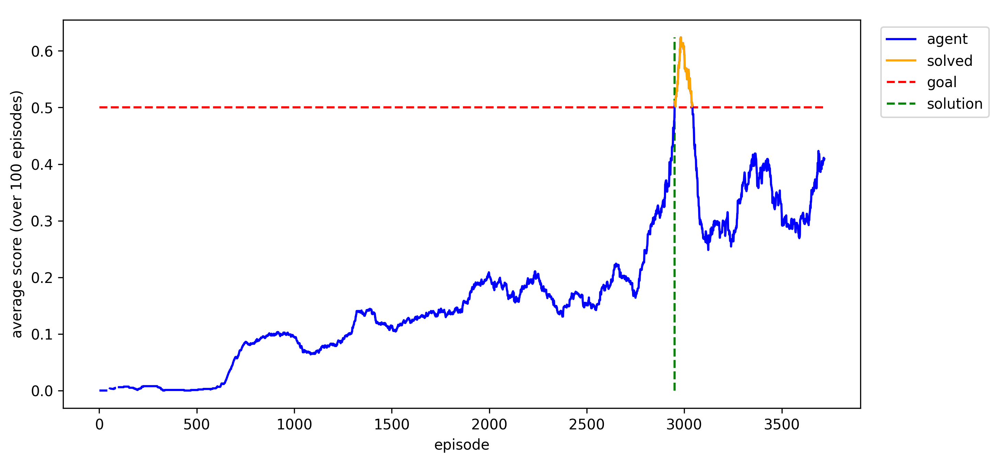

# Learning how to play tennis using DRL

This repository provides code to for ML agents to learn how to play tennis using deep reinforcement learning in the environment provided by the [Unity Machine Learning Agents Toolkit](https://github.com/Unity-Technologies/ml-agents/blob/master/docs/Learning-Environment-Examples.md#reacher).

## Introduction

In the tennis enviroment, two players control their respective racket to play the ball over the net. The goal of the enviroment is to train a ML agent to play the ball over the net, without playing it out of bounds - thus learning to play a decent game of tennis. 

*(Note that the goal of this environment is not to play a "correct" game of tennis following all the rules - it's more comparable to a child learning the basic movements needed to hit a ball with a racket in a controlled manner).*

## Learning Task

The learning task is given by the following table

Attribute | Description
--- | ---
Goal | Keep the tennis ball in play.
Goal (RL) | Maximize expected cumulative reward.
Observations | `Box(8)`, eight continuous variables correspond to the position and velocity of the ball and racket. Each agent receives its own local observation. The actual observation is a stacked vector of three observations, thus resulting in a `Box(24)` continuous vector observation.
Actions | `Box(2)`, two continuous variables correspond to the movement in direction of the net (positive or negative) and to a jumping movement.
Rewards | +0.1 for hitting the ball over the net   -0.01 for hitting the ball out of bounds

The task is episodic and ends whenever the ball touches the ground. In order to solve the environment, an **average score of +0.5** over 100 consecutive episodes is needed. The score is computed as follows:
- After each episode, the rewards for each agent are added up (no discounting), to get a score for each agent. 
- The maximum of these two (potentially different) scores is taken.
- This yields a single **score** for each episode.

## Training instructions

Follow the instructions in [`training.ipynb`](./training.ipynb) to see how an agent can be trained.

## Experiments

This is a multi-agent environment. However, the goal of either agent can be fully described through its own local reward and hence, the two agents can be trained at the same time by the same RL algorithm, such as DDPG. I ran the standard DDPG algorithm with hyperparameters similar to those in the original DDPG paper by Lillicrap et al. [2015]. Learning succeeded, though it was a bit unstable. The agent learned to solve the environment, but again "forgot" shortly thereafter. The learning plot can be seen below.

A demo of this trained agent can be run from [`demo.ipynb`](./demo.ipynb).

## Further Work

The network can obviously be improved by running a more extensive random/grid search for optimizing the hyperparameters. 

Another suggestion would be to implement multiple actors and choose the action with maximum value (as evaluated by the critic) to make learning more stable. Adding noise into the network weights rather than the actions directly could also help the learning process be more stable, as well as pre-training the critic and then updating the actor less frequently. 
